# Dot(.)files

_My dialy driver since ~February 2025_

This repository contains all my configurations. It’s meant as a reference for how I set up my environment.

These files reflect my workflow and personal taste. Browse through, grab ideas, and build your own setup ;)

> I don’t have a full installation script because I hate the idea of blindly running something to replicate a setup from scratch. There is a symlink script to link some of the dotfiles, but it’s just for convenience — it won’t recreate the whole system.

## Setup

- **OS:** [Arch Linux](https://archlinux.org/)
- **WM:** [Hyprland](https://hyprland.org/)
- **Terminal:** [Kitty](https://github.com/kovidgoyal/kitty)
- **Shell:** [Zsh](https://github.com/zsh-users/zsh) + [Antidote](https://antidote.sh/) ([Plugins](zsh/.zsh_plugins.txt))
- **Font:** [JetBrainsMono](https://www.jetbrains.com/lp/mono/)
- **Theme:** [Gruvbox](https://github.com/morhetz/gruvbox)
- **Cursor:** [Hackeyed](https://www.gnome-look.org/p/999998)
- **Display Manager:** [SDDM](https://github.com/sddm/sddm) ([config](https://github.com/Keyitdev/sddm-astronaut-theme))
- **Notification:** [SwayNC](https://github.com/ErikReider/SwayNotificationCenter)
- **Bar:** [Waybar](https://github.com/Alexays/Waybar)
- **Launcher:** [Rofi](https://github.com/davatorium/rofi)
- **Music Player:** [Kew](https://github.com/ravachol/kew)
- **File Managers:** [Thunar](https://github.com/xfce-mirror/thunar) (GUI), [Yazi](https://yazi-rs.github.io/) (TUI)
- **Editor:** [Neovim](https://github.com/neovim/neovim)

> _I love the terminal ❤︎_

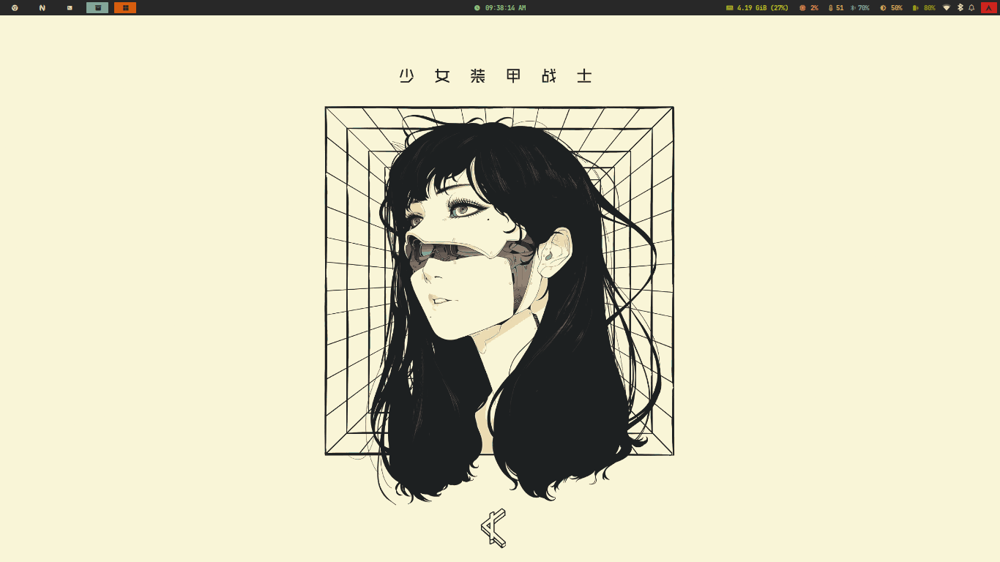

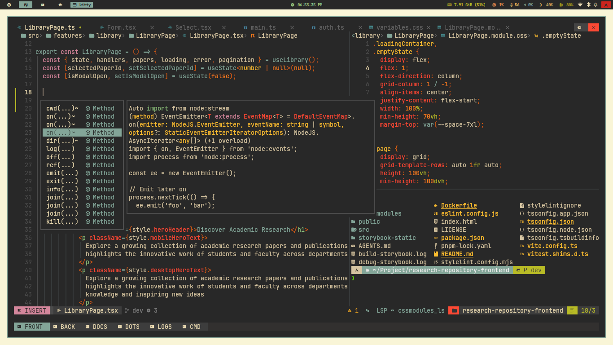

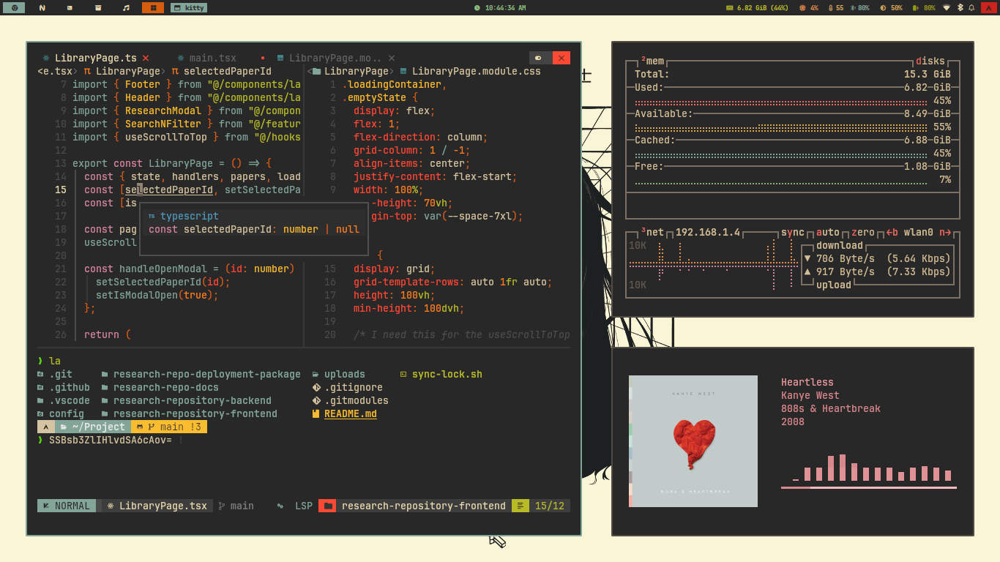

Screenshots with configs

_click the link to open their configuration_

> This is mostly CLI/TUI configurations.

[Hyprland](hypr/),
[Neovim](https://github.com/r4ppz/nvZzz),
[Kitty](kitty/),
[Tmux](tmux/),
[Waybar](waybar/),
[Zsh](zsh/),

|                                                                                                                                                                                                                                                                    |                                                                                                                                           |
| ------------------------------------------------------------------------------------------------------------------------------------------------------------------------------------------------------------------------------------------------------------------ | ----------------------------------------------------------------------------------------------------------------------------------------- |
| 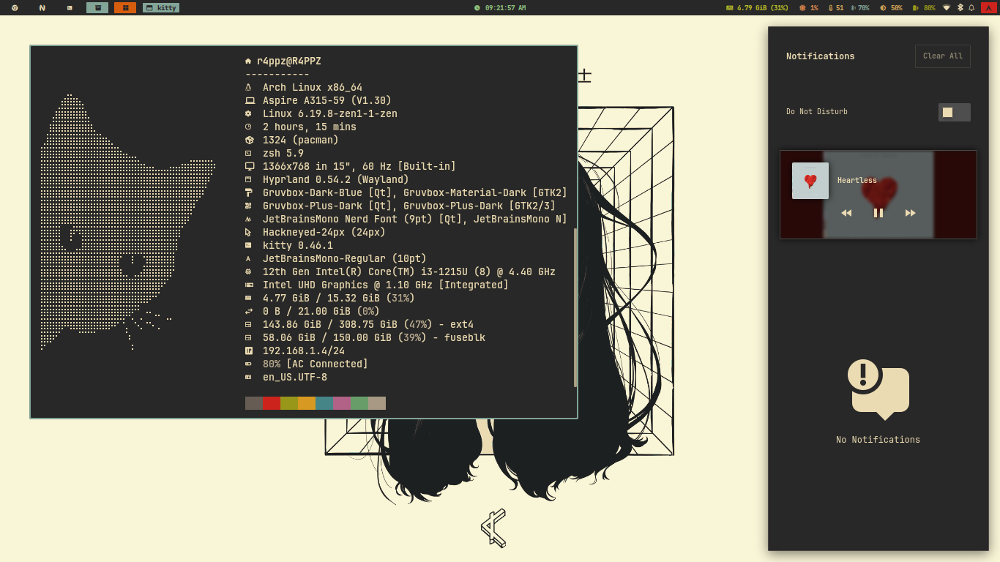 [SwayNC](swaync/), [FastFetch](fastfetch)                                                                                                                                               | 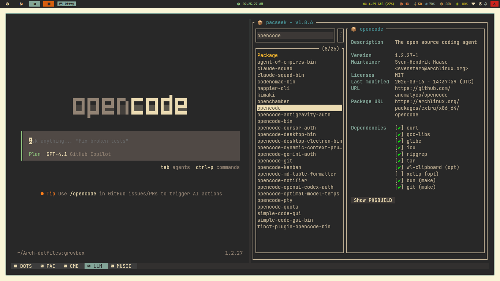 [OpenCode](opencode/), [Pacseek](pacseek/)                     |
| 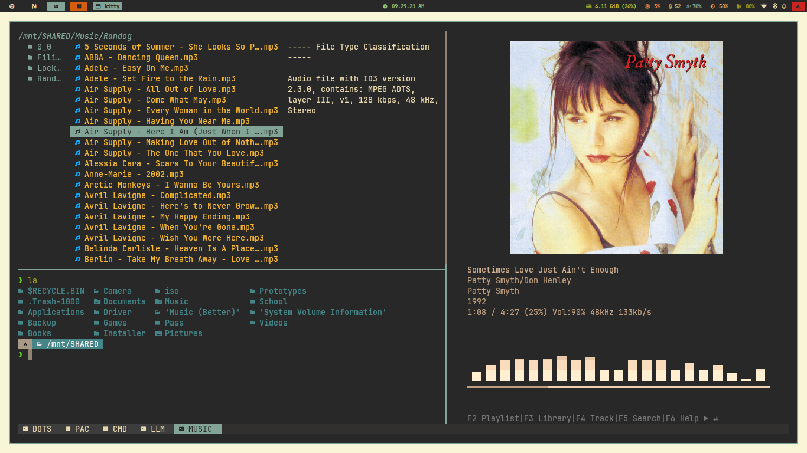 [Yazi](yazi/), Kew                                                                                                                                                                      | 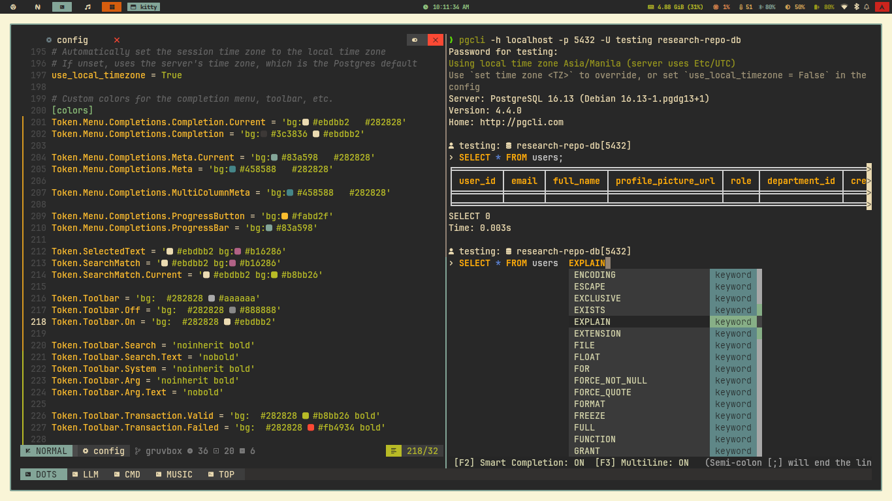 [pgcli](pgcli/)                                                |
| 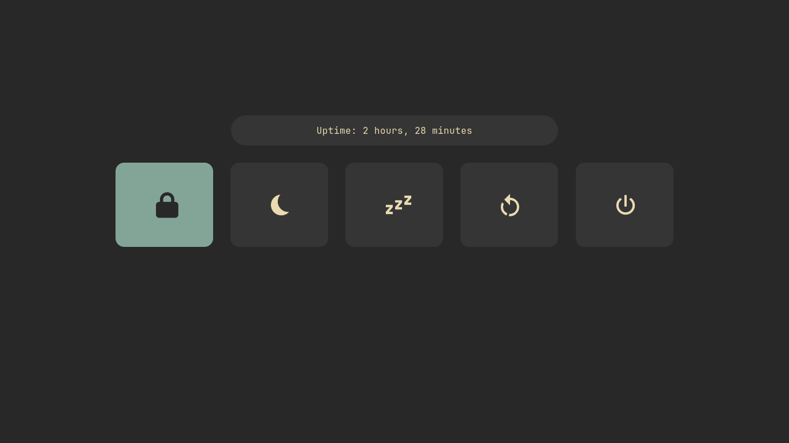 Rofi ([PowerMenu](rofi/powermenu/))                                                                                                                                                     | 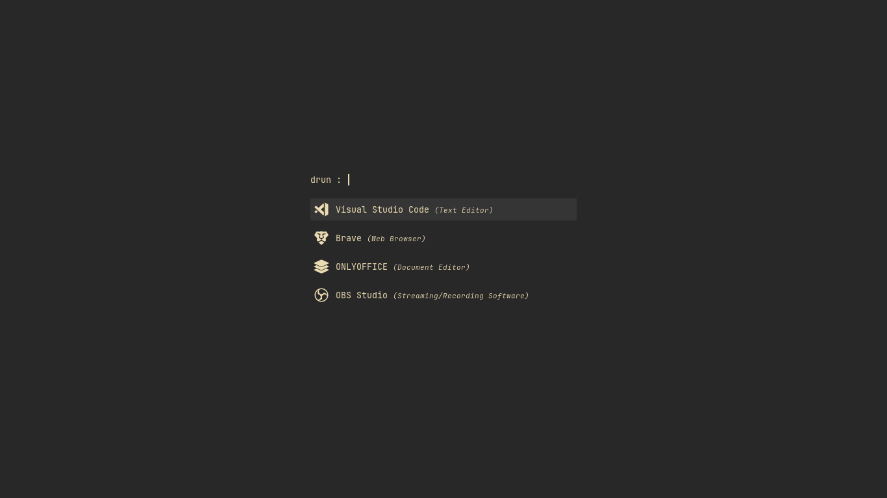 Rofi ([App Launcher](rofi/launcher))                           |
| 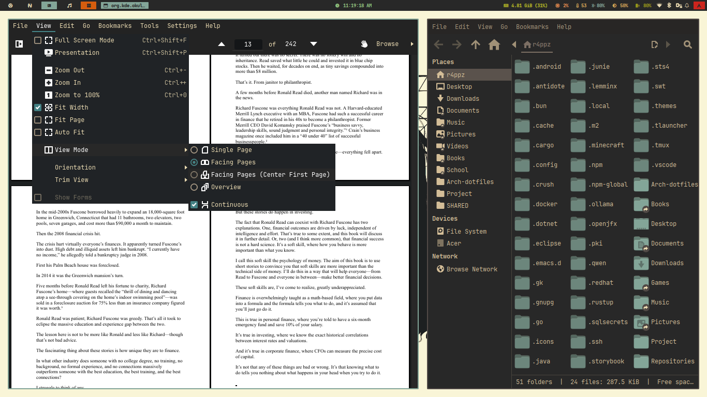 [GTK](https://github.com/TheGreatMcPain/gruvbox-material-gtk), [QT](https://github.com/sachnr/gruvbox-kvantum-themes) and [Icons](https://github.com/SylEleuth/gruvbox-plus-icon-pack)  | 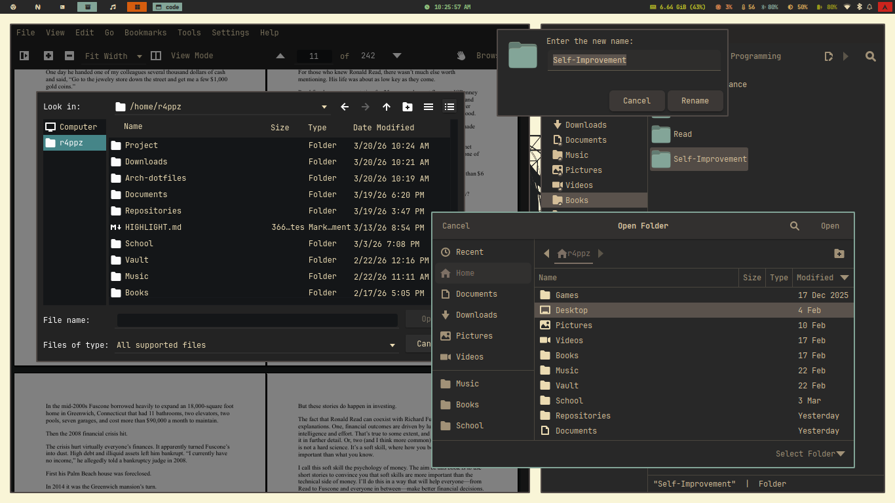 GTK and QT ([floating rules](hypr/appearance/windowrule.conf)) |
| 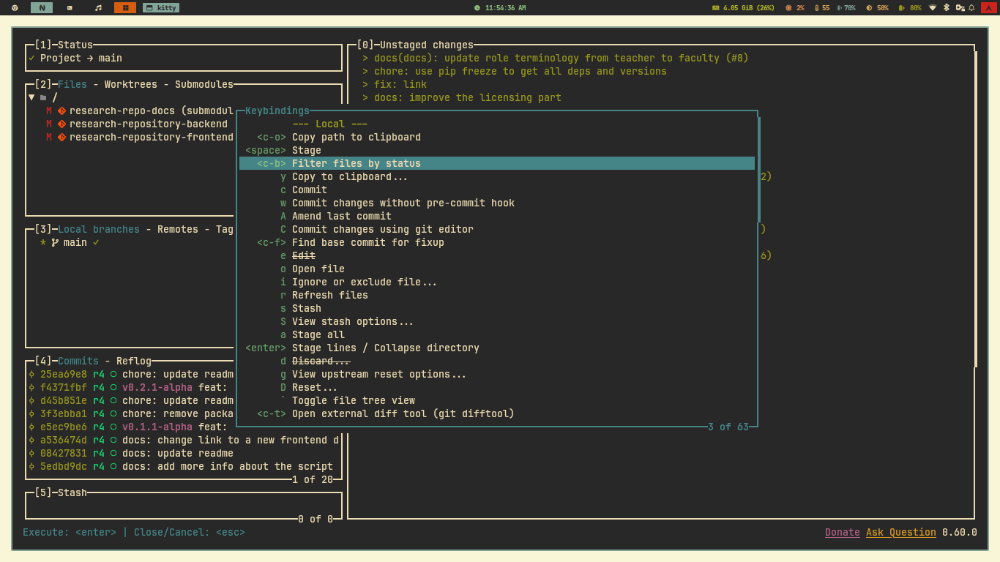 [LazyGit](lazygit/)                                                                                                                                                                     | 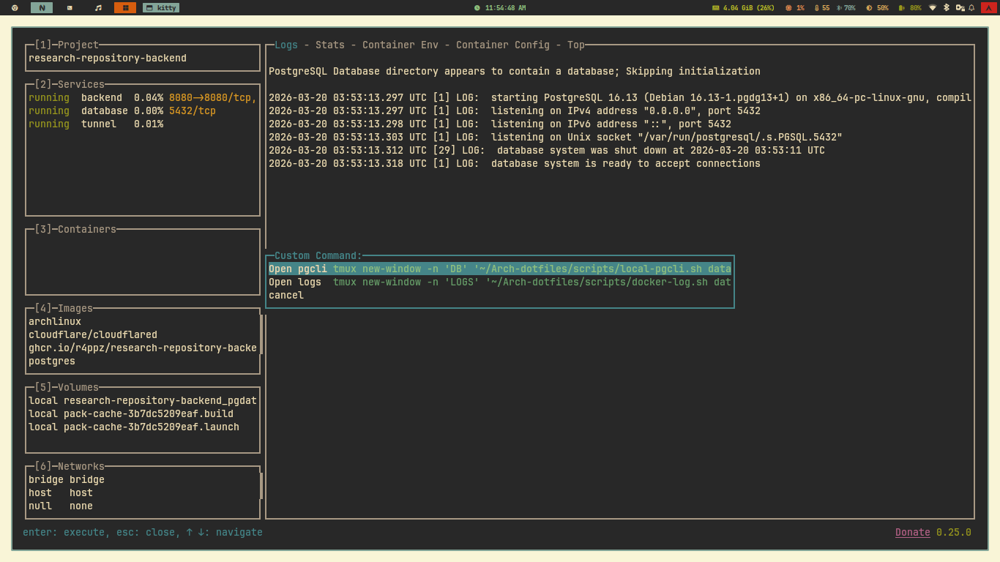 [LazyDocker](lazydocker) ([custom script](scripts/))           |
| 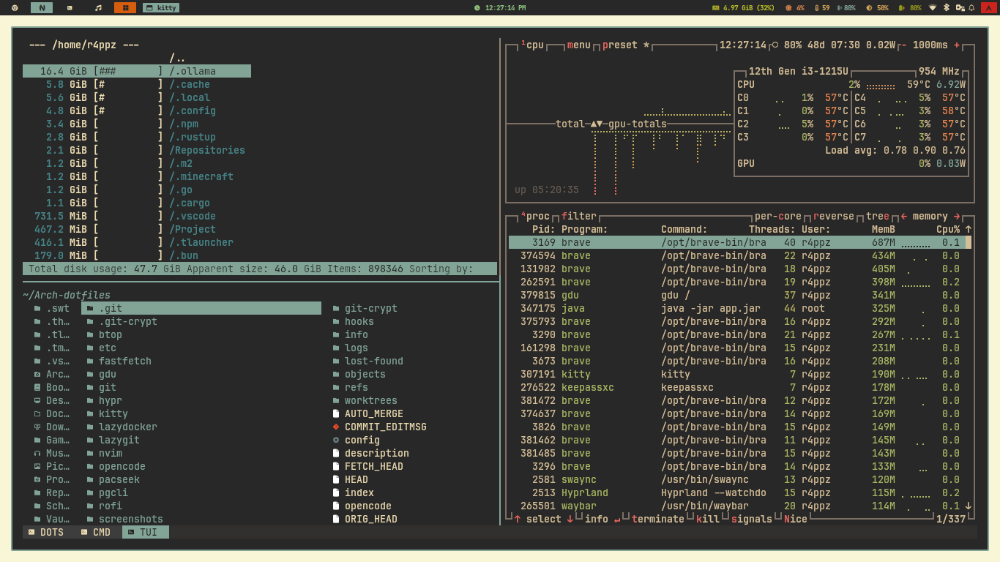 [gdu](gdu/), [Yazi](yazi/), [Btop](btop/)                                                                                                                                               |                                                                                                                                           |

